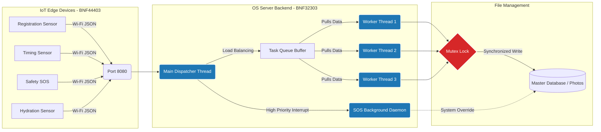

```mermaid
graph LR
    %% Physical Layer
    subgraph IoT Edge Devices [IoT Edge Devices - BNF44403]
        R[Registration Sensor] -->|Wi-Fi JSON| Gateway(Port 8080)
        T[Timing Sensor] -->|Wi-Fi JSON| Gateway
        S[Safety SOS] -->|Wi-Fi JSON| Gateway
        H[Hydration Sensor] -->|Wi-Fi JSON| Gateway
    end

    %% OS Layer
    subgraph OS Backend [OS Server Backend - BNF32303]
        Gateway --> Main(Main Dispatcher Thread)
        
        %% Standard Data Flow
        Main -->|Load Balancing| Queue[Task Queue Buffer]
        Queue -->|Pulls Data| W1(Worker Thread 1)
        Queue -->|Pulls Data| W2(Worker Thread 2)
        Queue -->|Pulls Data| W3(Worker Thread 3)
        
        %% High Priority Interrupt
        Main -->|High Priority Interrupt| SOS(SOS Background Daemon)
    end

    %% Storage Layer
    subgraph Storage [File Management]
        W1 --> Mutex{Mutex Lock}
        W2 --> Mutex
        W3 --> Mutex
        Mutex -->|Synchronized Write| DB[(Master Database / Photos)]
        SOS -.->|System Override| DB
    end
    
    %% Styling
    classDef os fill:#1f77b4,stroke:#fff,stroke-width:2px,color:#fff;
    classDef lock fill:#d62728,stroke:#fff,stroke-width:2px,color:#fff;
    class Main,W1,W2,W3,SOS os;
    class Mutex lock;
```
